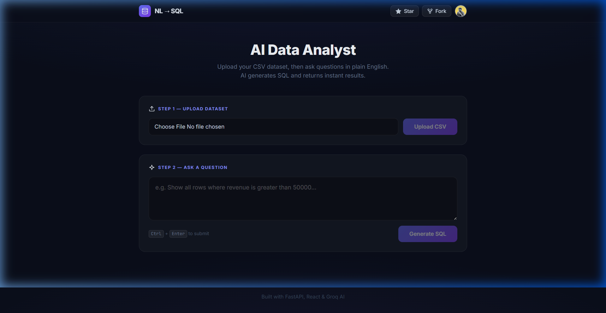
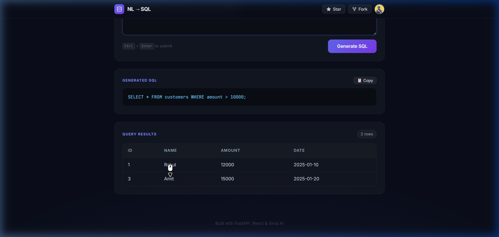

<div align="center">

# 🗃️ NL → SQL

### Natural Language to SQL Generator

Convert plain English questions into SQL queries instantly using AI.

[](https://nl-sql-teal.vercel.app/)
[](https://github.com/omsudhamsh/nl-sql/stargazers)
[](LICENSE)

<br/>



</div>

---

## ✨ Features

- 🧠 **AI-Powered** — Converts natural language to SQL using Groq's LLaMA 3.1 model
- ⚡ **Instant Results** — Get SQL queries and database results in seconds
- 📋 **Copy SQL** — One-click copy for generated queries
- ⌨️ **Keyboard Shortcut** — `Ctrl + Enter` to submit
- 🌙 **Modern Dark UI** — Premium glassmorphism design with smooth animations
- 🔒 **Safe Queries** — Only `SELECT` statements are allowed (no data modification)

---

## 📸 Screenshots

<div align="center">

| Ask a Question | Get Results |
|:-:|:-:|
|  |  |

</div>

---

## 🏗️ Architecture

```
┌─────────────────────────────────────────────────────────┐
│                    FRONTEND (Vercel)                     │
│                                                         │
│   React + Vite + Tailwind CSS                           │
│   ┌───────────────────────────────────────────┐         │
│   │  User types natural language question     │         │
│   │  ───────────────────────────────────────   │         │
│   │  "Show customers with amount > 10000"     │         │
│   └────────────────────┬──────────────────────┘         │
│                        │ POST /query                    │
└────────────────────────┼────────────────────────────────┘
                         │
                         ▼
┌─────────────────────────────────────────────────────────┐
│                   BACKEND (Render)                       │
│                                                         │
│   FastAPI + Python                                      │
│   ┌─────────────────┐    ┌──────────────────────┐       │
│   │   /query API    │───▶│  Groq LLM (LLaMA 3) │       │
│   │   Endpoint      │◀───│  Generate SQL        │       │
│   └────────┬────────┘    └──────────────────────┘       │
│            │                                            │
│            ▼                                            │
│   ┌─────────────────┐                                   │
│   │   SQLAlchemy    │                                   │
│   │   Execute SQL   │                                   │
│   │   on SQLite DB  │                                   │
│   └─────────────────┘                                   │
└─────────────────────────────────────────────────────────┘
```

### Request Flow

1. User enters a **natural language question** in the frontend
2. Frontend sends a `POST` request to the FastAPI backend
3. Backend forwards the question to **Groq AI (LLaMA 3.1-8B)**
4. LLM generates a `SELECT` SQL query based on the database schema
5. Backend **executes the SQL** on the SQLite database
6. Results are returned as JSON and displayed in a clean table

---

## 🛠️ Tech Stack

| Layer | Technology | Purpose |
|-------|-----------|---------|
| **Frontend** | React 19, Vite 7, Tailwind CSS 4 | UI & styling |
| **Backend** | FastAPI, Python | REST API |
| **AI/LLM** | Groq Cloud, LLaMA 3.1-8B | NL → SQL conversion |
| **Database** | SQLite, SQLAlchemy | Data storage & querying |
| **Deployment** | Vercel (frontend), Render (backend) | Hosting |

---

## 🚀 Getting Started

### Prerequisites

- **Node.js** ≥ 18
- **Python** ≥ 3.9
- **Groq API Key** — Get one free at [console.groq.com](https://console.groq.com)

### 1. Clone the Repository

```bash
git clone https://github.com/omsudhamsh/nl-sql.git
cd nl-sql
```

### 2. Setup Backend

```bash
cd backend

# Create virtual environment
python -m venv venv

# Activate it
# Windows:
venv\Scripts\activate
# macOS/Linux:
source venv/bin/activate

# Install dependencies
pip install -r requirements.txt

# Create .env file
echo GROQ_API_KEY=your_groq_api_key_here > .env

# Run the backend
uvicorn app.main:app --reload
```

The API server will start at `http://127.0.0.1:8000`

### 3. Setup Frontend

```bash
cd frontend/nl-sql

# Install dependencies
npm install

# Run dev server
npm run dev
```

The app will be available at `http://localhost:5173`

---

## 📁 Project Structure

```
nl-sql/
├── backend/
│   ├── app/
│   │   ├── main.py          # FastAPI app + CORS + routes
│   │   ├── llm.py           # Groq LLM integration
│   │   ├── db.py            # SQLite database setup
│   │   └── utils.py         # SQL execution + safety checks
│   ├── requirements.txt
│   └── .env                 # API keys (not committed)
│
├── frontend/nl-sql/
│   ├── src/
│   │   ├── App.jsx          # Main application component
│   │   ├── index.css         # Premium dark theme styles
│   │   └── main.jsx         # React entry point
│   ├── index.html
│   ├── vite.config.js
│   └── package.json
│
├── assets/                  # Screenshots for README
└── README.md
```

---

## 🔒 Safety

- Only `SELECT` queries are allowed — the backend rejects any `INSERT`, `UPDATE`, `DELETE`, or `DROP` statements
- SQL is sanitized to remove markdown formatting from LLM output
- CORS is configured for secure cross-origin requests

---

## 📄 License

This project is licensed under the MIT License — see the [LICENSE](LICENSE) file for details.

---

<div align="center">

**Built by [Om Sudhamsh Padma](https://github.com/omsudhamsh)**

⭐ Star this repo if you found it useful!

</div>